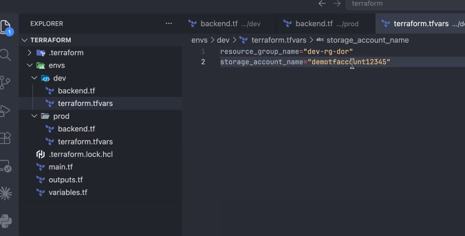
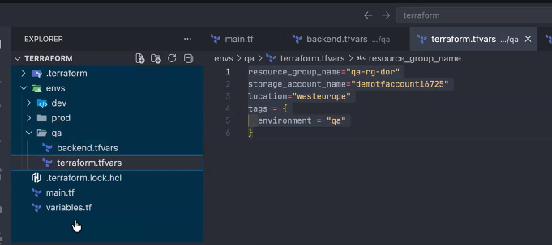

install terraform first
- use chocolatey or winget for windows
- brew for mac
always run 'terraform init' first to initialize your terraform folder
- it should be run in the 3 folders:
    - from_class_dor
    - learn-terraform-azure
    - terraform-complete